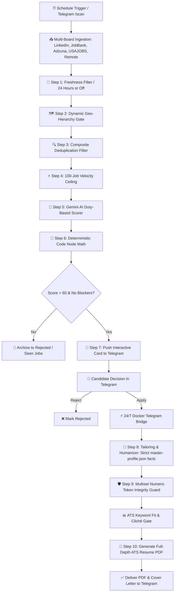

# 🚀 Jobryt AI Agent — Autonomous Multi-Board Job Discovery & ATS Application Bot

> **An autonomous, local, BYOK (Bring-Your-Own-Key) AI job application engine.**  
> Continuously searches 8 job feeds, eliminates duplicates, evaluates duty-based match scores with Gemini AI, pushes interactive approval cards to Telegram, and upon clicking **[Apply]**, generates tailored zero-fabrication cover letters and executive ATS PDF resumes delivered directly to your chat.

---

## ⚡ Quick Start: Get Running in 3 Minutes

### 🪄 Option A: The 2 min Interactive Setup Wizard (Recommended)

Run this single command in your terminal. It will guide you step-by-step, **auto-generate your security encryption keys**, and write your `.env` configuration file automatically:

```bash
git clone https://github.com/udaygandra/jobryt-ai-agent.git
cd jobryt-ai-agent
npm install
node setup.js   # or: npm run setup
```

---

### 📝 Option B: Manual Setup Guide (How to Get Your Keys in 2 Minutes)

If you prefer to configure `.env` manually, copy the template and fill in the keys:
```bash
cp .env.example .env
```

Here is exactly how to get each key—even if you've never used an API before:

#### 1. 🤖 Telegram Bot Token (Takes 30 seconds)
1. Open the **Telegram** app on your phone or desktop.
2. In the top search bar, search for: **`@BotFather`** *(official bot with a blue verification checkmark)*.
3. Tap **Start**, then send the message: **`/newbot`**
4. Follow the prompt to give your bot a name (e.g., `MyJobBot`) and a username ending in `bot` (e.g., `MyJobHunter_bot`).
5. BotFather will reply with an API token looking like this: `123456789:ABCdefGh_...`
6. Copy and paste it into `TELEGRAM_BOT_TOKEN`.

#### 2. 👤 Telegram Chat ID (Takes 10 seconds)
1. In Telegram, search for: **`@userinfobot`**
2. Tap **Start** (or send `hi`).
3. The bot will instantly reply with your account details. Look for the number next to **Id** (e.g. `123456789`).
4. Copy and paste that number into `TELEGRAM_CHAT_ID`.  
   *(This ensures only YOU can control the bot, receive alerts, and receive resumes!)*

#### 3. 🧠 Google Gemini API Key (Default: $0 Cost)
* **$0 Free Mode (Default):** Gemini is default for **100% $0 cost** via Google AI Studio's free tier API keys.
* **Pay-As-You-Go Mode:** If you prefer paid models, set `LLM_PROVIDER=openai` (GPT-4o) or `LLM_PROVIDER=claude` (Claude) in `.env`.
1. Open in your browser: **[aistudio.google.com/app/apikey](https://aistudio.google.com/app/apikey)**
2. Sign in with any free Google / Gmail account.
3. Click the blue button: **"Create API key"** (in a new project).
4. Copy the key (starts with `AIzaSy...`) and paste it into `GEMINI_API_KEY`.

#### 4. 🔒 n8n Encryption Key (Auto-Generated)
* If you ran `npm run setup`, this 32-character key is **generated automatically** for you!
* If manual, you can use any random 32-character text string (e.g., `a1b2c3d4e5f6g7h8i9j0k1l2m3n4o5p6`) to encrypt credentials inside n8n's local database.

#### 5. 💼 Job Board Keys (Adzuna & USAJOBS)
* **Adzuna API** (Free at **[developer.adzuna.com](https://developer.adzuna.com/)**): Click "Sign Up", verify email, and paste your `App ID` and `App Key`.
* **USAJOBS API** (Free at **[developer.usajobs.gov](https://developer.usajobs.gov/)**): Required **only** if targeting US Federal Government jobs.
* *(Note: LinkedIn, Canada Job Bank, Jobicy, Remotive, Himalayas, and ArbeitNow work with **$0 cost and NO keys required**).*

#### 6. 🤝 Recruiter & Hiring Outreach (Serper & Hunter.io — Optional)
* **$0 Free Mode & Automatic Google Fallback**: If you skip these, or if any provided API key is stale, expired, invalid, or rate-limited, the bot **automatically and seamlessly falls back to 1-Tap Google X-Ray Search** (`site:linkedin.com/in ("talent acquisition" OR recruiter) "Company" "City"`) and direct LinkedIn search links with ready-to-copy connection notes on every application with zero interruptions.
* **Serper API** (Free 2,500 Google searches at **[google.serper.dev](https://google.serper.dev/)**): Automatically extracts real recruiter names and LinkedIn profiles directly into Telegram.
* **Hunter.io API** (Free 25 searches/mo at **[hunter.io](https://hunter.io/)**): Finds verified recruiter and HR work emails.


### Step 2: Ingest Your Resume (Zero-Fabrication)

Instead of hand-crafting JSON, ingest your existing resume (`.pdf`, `.docx`, or `.txt`). The AI will extract your verified work experience, achievements, and skills into `data/profiles/master-profile.json` with **strict zero hallucination**:

```bash
npm run parse-resume "C:\path\to\Your_Resume.pdf"
```

*(💡 Pro-Tip: You can also skip this and simply drop your resume file directly into your Telegram bot chat after starting!)*

---

### Step 3: Launch the Bot & n8n Engine

```bash
npm start
```

#### 🐳 How n8n is Setup & Run (Zero-Configuration)
* **The Easiest & Recommended Way:** Simply run **`npm start`**. It handles everything in one command:
  1. Launches both the **n8n workflow engine** and the **24/7 Telegram bridge** in background Docker containers (`docker compose up -d`).
  2. Automatically auto-provisions and synchronizes `workflows/master-workflow.json`, webhooks, and project permissions into n8n's SQLite database (`sync-n8n-db.js`).
  3. Installs needed container dependencies (`xlsx`, `pdfkit`) and streams real-time bridge logs to your terminal.
  4. **Zero manual imports or database setup required!**
* **Optional — Running n8n Prior to the App / Standalone:**
  If you ever want to launch n8n by itself before starting the bot (e.g. to inspect the visual workflow canvas in your browser):
  ```bash
  docker compose up -d n8n
  ```
  Open **`http://localhost:5678`** in your browser to view the visual workflow editor. When you are ready to start the Telegram bot, simply run `npm start`.

> [!TIP]
> **Do I need to sign up or activate an n8n license?**  
> **No!** You never even need to open `http://localhost:5678` for the bot to work—everything runs 100% headless directly inside Telegram.  
> If you choose to open `http://localhost:5678` in your browser to inspect the visual workflow canvas:
> 1. **Owner Setup Screen:** Enter any local email (e.g. `admin@local.dev`) and password. This is just a local password for your browser.
> 2. **License Screen:** Simply click **"Skip"** or **"Continue with Community Edition"**. It is 100% free with all features included. No license key or payment is ever required.

Open Telegram, message your bot `/start`, and you are ready for action!

---

## 📱 Telegram Command Center & Daily Workflow

Once running, your Telegram chat becomes your mobile command cockpit:

```
┌────────────────────────────────────────────────────────┐
│ 🔔 High-Fit Opportunity Alert (Match: 86/100)          │
│                                                        │
│ 💼 Senior Data Analyst                                 │
│ 🏢 Shopify • Toronto, ON (Hybrid)                      │
│ 💰 Compensation: $120,000 - $145,000 CAD               │
│                                                        │
│ 📊 Duty Breakdown:                                     │
│  • Title Relevance: 90/100                             │
│  • Skills Fit: 85/100 (SQL, Python, dbt, Looker)       │
│  • Seniority Fit: 85/100 (5+ Yrs Required)             │
│                                                        │
│ 💡 Why this fits: Directly aligns with your 4 years of │
│    analytics engineering and pipeline modeling.        │
│                                                        │
│ [✅ Apply (ETA: 25s)]          [❌ Reject]             │
└────────────────────────────────────────────────────────┘
```

* **Tap `[✅ Apply]`**: Generates an executive ATS-compliant PDF resume and tailored cover letter referencing only verified facts from `master-profile.json`, delivered directly into your chat in **~25 seconds**.
* **Tap `[❌ Reject]`**: Archives the job into `data/tracking/seen_jobs.json` so it is never shown again.

### Telegram Slash Commands Reference

| Command | Action | Example |
| :--- | :--- | :--- |
| `/scan` | Trigger immediate live multi-board search & scoring | `/scan` |
| `/threshold <val>` | Update minimum score gate instantly | `/threshold 65` |
| `/freshness <hrs>` | Update lookback window or disable with `off` | `/freshness 24` or `/freshness off` |
| `/timezone <tz>` | Update scheduler timezone (e.g. `America/Toronto`) | `/timezone America/Vancouver` |
| `/roles <titles>` | Update target search roles | `/roles Data Analyst, BI Developer` |
| `/location <city>` | Update target search location | `/location Toronto, ON` |
| `/worktype <mode>` | Update arrangement (`Remote Only`, `Hybrid & Remote`, `Open to All`) | `/worktype Remote Only` |
| `/import-resume` | Upload a new resume (.pdf/.docx) to recalibrate profile | `/import-resume` |
| `/recruiters <company>` | Find recruiter contacts, hiring managers & 1-tap Google search | `/recruiters Shopify` |
| `/status` | View active profile, tracked counts, active model, and settings | `/status` |
| `/help` | Display interactive command menu | `/help` |

---

## 🌐 Included Job Boards & API Key Requirements

Jobryt AI Agent aggregates live postings across **8 distinct job feeds** simultaneously. **6 out of 8 feeds require NO API keys ($0, zero configuration)**:

### 🔑 Key Requirements by Country:
* 🍁 **If Targeting Canada (`country_scope: "CA"`):**
  * **Required:** Adzuna API (`ADZUNA_APP_ID`, `ADZUNA_APP_KEY` from [developer.adzuna.com](https://developer.adzuna.com/)).
  * **Zero Keys Needed:** **Canada Job Bank**, **LinkedIn**, **Jobicy**, **Remotive**, **Himalayas**, and **ArbeitNow** run with **$0 cost and no API keys**.
  * *(USAJOBS is automatically skipped in Canada mode).*
* 🇺🇸 **If Targeting the United States (`country_scope: "US"` or `"US_CA"`):**
  * **Required:** 
    1. **Adzuna API** (`ADZUNA_APP_ID`, `ADZUNA_APP_KEY`) for US commercial listings.
    2. **USAJOBS API** (`USAJOBS_API_KEY` from [developer.usajobs.gov](https://developer.usajobs.gov/)) for US Federal Government civil service positions.
  * **Zero Keys Needed:** **LinkedIn**, **Jobicy**, **Remotive**, **Himalayas**, and **ArbeitNow** continuously retrieve US private and remote tech jobs with no keys.

### 📊 Full Feeds Matrix:

| Job Board | Target Regions | API Key Required? | Where to Obtain Key |
| :--- | :--- | :---: | :--- |
| **LinkedIn Jobs** | Canada, US, Worldwide | 🚫 **None ($0)** | *No key needed (Direct Guest HTTP API)* |
| **Canada Job Bank** | Canada (All Provinces) | 🚫 **None ($0)** | *No key needed (Official Gov Scraper)* |
| **Jobicy Remote** | US, Canada, Global | 🚫 **None ($0)** | *No key needed (Official REST API)* |
| **Remotive Remote** | US, Canada, Global | 🚫 **None ($0)** | *No key needed (Official REST API)* |
| **Himalayas Remote** | US, Canada, Global | 🚫 **None ($0)** | *No key needed (Official REST API)* |
| **ArbeitNow** | US, Global Remote | 🚫 **None ($0)** | *No key needed (Official REST API)* |
| **Adzuna API** | Canada, US, UK, Global | 🔑 **Free Key** | [developer.adzuna.com](https://developer.adzuna.com/) |
| **USAJOBS** | United States (Federal) | 🔑 **Free Key** | [developer.usajobs.gov](https://developer.usajobs.gov/) |

---

## ⏱️ Freshness & Velocity Controls

The Freshness Filter controls how recently a job must have been published to be considered for evaluation:

* **`24 Hours (1 Day)` [Recommended Default]:** The gold standard for daily operation. Most recruiters review applicants within the first 24–48 hours. Running daily sweeps with a 24h window keeps pipeline runs fast (~1 minute).
* **`72 Hours (3 Days)`:** Ideal for **Monday morning catch-ups** to capture weekend postings before switching back to 24 hours (`/freshness 72`).
* **🚫 `Disabled / Off (Any Time)` (`/freshness off`):**
  * Evaluates **all active jobs**, regardless of posting date.
  * Perfect when starting a new search, exploring niche/executive titles, or casting the widest net.
  * **Why it still stays fast:** The **100-job velocity ceiling (`slice(0, 100)`)** always stays active, guaranteeing your scan never hangs or exhausts your Gemini quota.

---

## 🛠️ Useful NPM Commands

| Command | Action |
| :--- | :--- |
| `npm start` | Launches Docker containers and streams live Telegram bridge logs |
| `npm run republish:restart` | Injects updated node scripts into workflows, syncs n8n SQLite DB, and restarts containers |
| `npm run parse-resume <path>` | Ingests a PDF/DOCX resume into `data/profiles/master-profile.json` |
| `npm run test-resume <path>` | Previews resume parsing output without modifying your active profile |
| `npm test` | Runs fast onboarding state machine and rate-limit regression tests |
| `npm run test:all` | Runs comprehensive verification suite (All 10 workflow nodes, onboarding FSM, waterfall) |
| `npm run validate` | Tests all JavaScript in `0-resume-to-profile.json` and `master-workflow.json` for syntax errors |
| `npm run reset` | Soft-resets job tracking data (`seen_jobs.json`, `pending_approval.json`) for a clean fresh run |
| `npm run audit:security` | Runs an automated 6-layer security and vulnerability audit scan |

---

## 🌟 Key Highlights & Architectural Features

| Feature | Description | Benefit |
| :--- | :--- | :--- |
| **Multi-Source Parallel Ingestion** | Simultaneously queries **LinkedIn**, **Canada Job Bank**, **Adzuna**, **USAJOBS**, and **Global Remote Feeds**. | Aggregates all top job feeds in ~3–5s with **$0 cost** and **0 LLM tokens**. |
| **Strict Zero-Fabrication Engine** | Single source of truth is `data/profiles/master-profile.json`. Absolute ban on invented employers, dates, skills, metrics, or credentials. | Guarantees 100% factual accuracy and credibility in all resumes and cover letters. |
| **Universal Duty-Based Scoring** | Evaluates jobs based on functional responsibilities and transferrable skills rather than superficial job titles. | Unlocks high-paying roles that use alternative or non-standard title conventions. |
| **Deterministic Code Node Math** | Computes weighted arithmetic (`40% Title, 35% Skills, 15% Seniority, 10% Domain`) in JavaScript Code nodes rather than LLM prompts. | Completely eliminates LLM math hallucinations and scoring inconsistencies. |
| **Hard Title Gating & Disqualification** | Roles with title fit $< 50$ are capped at $\le 45$; explicit dealbreaker keywords immediately set overall score to `0`. | Blocks completely irrelevant roles (e.g. Sales Director vs Data Analyst) from alerting you. |
| **Multiset Numeric Integrity Guard** | Verifies token frequencies of all percentages, metrics, dollar values, and dates before and after humanization (`/\d[\d,.]*(?:%|[a-zA-Z]+)?/g`). | Prevents the model from subtly changing numbers (e.g. 15% to 50%) during text polishing. |
| **100-Job Velocity Ceiling** | Enforces a strict cap of 100 candidate jobs right before sending items to the scoring engine. | Prevents 30–45 minute batch delays and protects free-tier API quotas. |
| **Interactive Telegram Cockpit** | Rich HTML alert cards delivered directly to your mobile device with one-tap `[✅ Apply (ETA: 25s)]` and `[❌ Reject]` buttons. | Mobile-first command center: review and apply to jobs from anywhere in seconds. |
| **24/7 Docker Long-Polling Bridge** | Integrated Node.js Telegram runner that polls for button clicks and slash commands continuously. | No public webhooks, domain names, Cloudflare tunnels, or ngrok ports needed. |
| **Dual-Trigger Execution Parity** | The n8n UI schedule and the Telegram `/scan` command share identical filtering, scoring, and output logic. | Consistent, predictable results whether running in the background or triggered manually. |
| **10-Model Waterfall Quota Recovery** | Automatically cascades across 10 Gemini models (2.5 Flash, 2.0 Flash Lite, etc.) if rate limits (HTTP 429) occur. | Maximum uptime on 100% free-tier Gemini API keys. |
| **Dynamic Geo-Routing** | Resolves candidate country, provinces, states, and metro areas dynamically from `data/geo-hierarchy.json`. | Zero hardcoded geography; seamlessly handles US, CA, or dual-country preferences. |
| **Multi-Role Query Rotation** | Cycles through candidate target titles across search cycles. | Broadens search coverage across multiple careers without hitting board rate limits. |
| **Executive ATS PDF Resumes** | Generates formatted, multi-page, high-density ATS-compliant PDF resumes on demand. | Delivers ready-to-submit PDFs and tailored cover letters directly into Telegram. |

---

## 🔄 How the Master Workflow Operates



---

## 🕒 Candidate-Driven Timezone Scheduling

The automated scheduler evaluates your cron triggers (by default 5x daily at 8:30 AM, 11:30 AM, 2:30 PM, 5:30 PM, 8:30 PM) **strictly in your local timezone**, rather than UTC or the host server's clock.

* **Automatic Detection**: If `"timezone"` is omitted in `master-profile.json`, [`detectCandidateTimezone()`](scripts/core/geo-helper.js) analyzes your verified locations (*Toronto / Ontario* ➔ `America/Toronto`, *Vancouver / BC* ➔ `America/Vancouver`, *Austin / Texas* ➔ `America/Chicago`, *Calgary / Alberta* ➔ `America/Edmonton`, *Halifax / Nova Scotia* ➔ `America/Halifax`, *London / UK* ➔ `Europe/London`).
* **Workflow-Level Enforcement**: In n8n, `wf.settings.timezone` takes highest precedence. The Schedule Trigger calculates every run against this IANA timezone.
* **Database Synchronization**: [`scripts/admin/sync-n8n-db.js`](scripts/admin/sync-n8n-db.js) updates n8n's SQLite database (`UPDATE workflow_entity SET ..., settings = ?`), ensuring live container cron jobs fire at the candidate's exact local time.
* **Live Updates**: You can change your timezone anytime in Telegram with `/timezone <iana>` (or `/tz America/Vancouver`), which syncs `master-profile.json`, `settings.json`, and n8n immediately.

---

## 🔒 Security, Privacy & Production Hardening Guide

Production security, credential protection, and candidate data privacy are core design imperatives of Jobryt AI Agent. Follow these **8 production hardening pillars**:

### 1. 🌐 Don't Expose n8n to the Public Internet
* **Localhost Loopback Binding:** Always bind n8n to localhost (`127.0.0.1:5678`) in `docker-compose.yml`.
* **Zero-Port Ingress via Telegram Long-Polling:** Jobryt AI Agent does **not require any open inbound ports or webhooks**. The built-in Telegram Bridge connects outbound to Telegram's API via long polling, completely eliminating the need for public reverse proxies, ngrok, or Cloudflare tunnels for standard operation.
* **Remote Access via Private Tunnels:** If you need to access the n8n web UI remotely, access it through **Tailscale**, **WireGuard**, or a **Cloudflare Tunnel with Cloudflare Access** (login required in front of it).

### 2. 🔑 Protect Secrets & API Credentials
* **n8n Credential Store:** Keep Gemini, Adzuna, Hunter, and email credentials inside n8n's encrypted credential store or injected via environment variables—**never** hardcode them inside prompts, JavaScript Code nodes, or exported workflow JSON files.
* **Fixed Encryption Key:** Define a fixed `N8N_ENCRYPTION_KEY` in your `.env` and back it up separately in a password manager.
* **Strict Git Shielding:** `.env` is strictly ignored by `.gitignore`. Verify security anytime:
  ```bash
  npm run audit:security
  ```

### 3. 🛡️ Harden the Docker Container
The production `docker-compose.yml` service definition includes:
```yaml
environment:
  - NODES_EXCLUDE=["n8n-nodes-base.executeCommand"]
  - EXECUTIONS_DATA_PRUNE=true
  - EXECUTIONS_DATA_MAX_AGE=168          # Prune execution history older than 7 days
  - EXECUTIONS_DATA_SAVE_ON_SUCCESS=none # Do not store inputs/outputs for successful runs
```
* **Disable Command Execution Nodes:** Prevents arbitrary shell execution through workflow definitions.
* **Never Mount Docker Socket:** Never mount `/var/run/docker.sock` into the container.

### 4. 👤 Protect Candidate Personal Data
* **Prune Execution History:** With `EXECUTIONS_DATA_SAVE_ON_SUCCESS=none` and `EXECUTIONS_DATA_PRUNE=true`, unredacted resumes do not accumulate in the database.
* **Redact Sensitive PII Before LLM Submission:** The scoring prompt (`prompts/job-scoring.txt`) completely omits candidate phone numbers and personal emails.
* **Data Retention Policy:** Periodically clean out archived profiles and temporary PDFs you no longer need:
  ```bash
  npm run reset
  ```

### 5. 🛑 Treat Job Postings as Hostile Input (Prompt Injection Defense)
* **Strict XML Data Barriers:** All job descriptions and resume data are quarantined inside explicit XML boundaries (`<job_posting>`, `<candidate>`) with hard directives to ignore commands within them.
* **Deterministic Code Node Scoring:** Never let the LLM calculate its own final score. The Gemini model only outputs normalized 0–100 integer sub-scores. The final qualification score is calculated by a deterministic JavaScript Code node.
* **No Autonomous Tool Execution:** The scoring LLM has **zero tool-calling access** to the filesystem, network, or external APIs.
* **Human-in-the-Loop Gate:** Applications and cover letters are staged for your review and approval in Telegram.

### 6. 🔒 Lock Down URL Fetching & Prevent SSRF
* **Protocol & Domain Allowlisting:** Scrapers query only official, hardcoded HTTPS endpoints (LinkedIn, Canada Job Bank, Adzuna, USAJOBS, Jobicy, Remotive, ArbeitNow, Himalayas).
* **No User-Supplied Web Crawling:** The system never crawls arbitrary external URLs.

### 7. 📤 Uploads & Email Infrastructure Safety
* **File Size & Type Whitelisting:** Resume uploads via Telegram are restricted to $\le 5\text{ MB}$ (configurable via `MAX_UPLOAD_SIZE_MB`) and valid formats (`.pdf`, `.docx`, `.txt`).
* **Macro-Free Ingestion:** Word documents (`.docx`) are parsed via pure in-memory XML extraction (`word/document.xml`), making Word macro execution impossible.
* **Email Safety:** Outbound SMTP uses authenticated credentials and stages every draft for human approval.

### 8. 💾 Backups, Auditing & Monitoring
* **Encrypted Backups:** Regularly back up `data/` and `n8n_data`.
* **Automated Failure Alerts:** Master workflows include error trigger nodes that alert your Telegram chat.
* **Automated Security Audit:** Execute the automated security scan at any time:
  ```bash
  npm run audit:security
  ```

---

## ⚙️ Configuration Reference

### Environment Variables (`.env`)

Every variable supported by the application is listed below. Copy `.env.example` to `.env` to configure.

| Variable | Required | Default | Description |
| :--- | :---: | :--- | :--- |
| `TELEGRAM_BOT_TOKEN` | **Yes** | — | Telegram Bot API token from `@BotFather`. |
| `TELEGRAM_CHAT_ID` | **Yes** | — | Your numeric Telegram chat ID from `@userinfobot`. |
| `TELEGRAM_ALLOWED_USER_IDS` | No | `${TELEGRAM_CHAT_ID}` | Comma-separated list of authorized chat/user IDs. |
| `TELEGRAM_BOT_USERNAME` | No | — | Optional bot username for display. |
| `GEMINI_API_KEY` | **Yes\*** | — | Google Gemini API key from [aistudio.google.com](https://aistudio.google.com/) (*if using Gemini). |
| `LLM_PROVIDER` | No | `gemini` | Active AI provider: `gemini`, `openai`, `claude`, `groq`, `deepseek`, `openrouter`, `ollama`. |
| `LLM_MODEL` | No | *(waterfall)* | Optional model override (e.g. `gpt-4o-mini`). Omit to use the 10-model waterfall. |
| `N8N_ENCRYPTION_KEY` | **Yes** | — | 32-character hex key for encrypting n8n credentials database. |
| `N8N_PORT` | No | `5678` | Local port for n8n web dashboard. |
| `N8N_HOST_BINDING` | No | `127.0.0.1` | Local IP binding for loopback security. |
| `ADZUNA_APP_ID` | No | — | Adzuna Job Board API App ID. |
| `ADZUNA_APP_KEY` | No | — | Adzuna Job Board API Key. |
| `USAJOBS_API_KEY` | No | — | USAJOBS Federal API Key (for US searches). |
| `SERPER_API_KEY` | No | — | Google Serper API key for automated recruiter discovery. |
| `HUNTER_API_KEY` | No | — | Hunter.io API key for recruiter email verification. |
| `MIN_SCORE_THRESHOLD` | No | `60` | Minimum match score (0–100) to push Telegram alert card. |
| `MAX_UPLOAD_SIZE_MB` | No | `5` | Maximum allowed resume file upload size in MB. |
| `TIMEZONE` | No | `America/Toronto` | Local timezone for cron scheduling (auto-detected if omitted). |
| `DATA_DIR` | No | `./data` | Directory for profiles, database, and settings. |

### User Settings (`data/config/settings.json`)

Non-secret preferences can be edited directly or changed interactively via `/settings` in Telegram:

| Key | Type | Default | Description |
| :--- | :---: | :--- | :--- |
| `freshness_hours` | Number | `24` | Maximum job posting age in hours (`0` = any time / disabled). |
| `score_threshold` | Number | `60` | Minimum overall qualification score (0–100) to trigger alerts. |
| `cron_schedule` | String | `'30 8,11,14,17,20 * * *'` | Standard 5-part cron expression for scheduled scans. |
| `work_type` | String | `'Open to All'` | Mode: `'Remote Only'`, `'Hybrid & Remote'`, or `'Open to All'`. |
| `country_scope` | String | `'AUTO'` | Country routing: `'CA'`, `'US'`, `'US_CA'`, `'GLOBAL'`, or `'AUTO'`. |
| `timezone` | String | `'America/Toronto'` | Local timezone for schedule execution. |
| `boards_enabled` | Object | All `true` | Individual toggles for each of the 8 supported job boards. |

---

## 📚 Complete Project Documentation

For contributors and operators seeking deep implementation details:

- 🏗️ **[System Architecture & Design Specification](docs/ARCHITECTURE.md)**: Deep dive into the 3-stage pipeline, deterministic code-node scoring, prompt injection defenses, and the 10-model waterfall.
- 👨‍💻 **[Developer & Contributor Guide](docs/DEVELOPER_GUIDE.md)**: How to set up locally, add new job boards, debug nodes, and run tests.
- ⚙️ **[Scripts Architecture Guide](scripts/README.md)**: Overview of `core/`, `engine/`, `bot/`, and `admin/` modules.
- 📝 **[Prompts & JSON Schemas Guide](prompts/README.md)**: Zero-fabrication prompts, XML data barriers, and JSON response schemas.
- 🧪 **[Test Harness & Verification Guide](tests/README.md)**: Complete guide to node testing, onboarding FSM validation, and LLM rate-limit tests.
- 🗄️ **[Data Directory Guide](data/README.md)**: Authoritative profile structure and persistent application tracking state layout.
- 🔄 **[Workflows Guide](workflows/README.md)**: Overview of `0-resume-to-profile.json` and `master-workflow.json`.

---

## 📄 License
MIT License — built for autonomous, personal job search automation.
